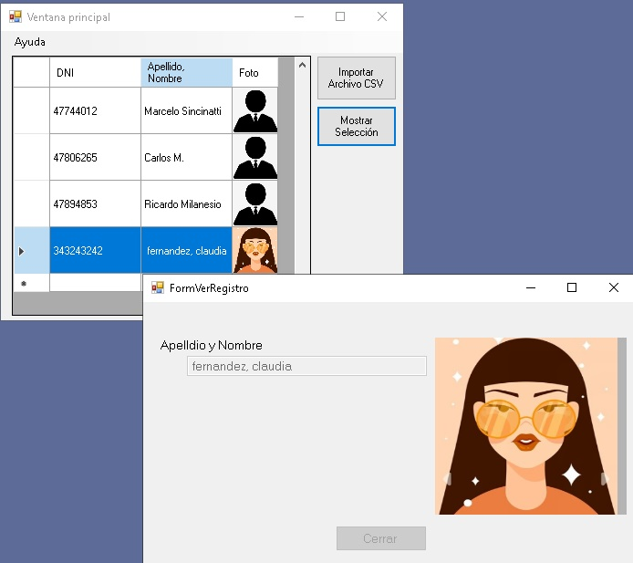
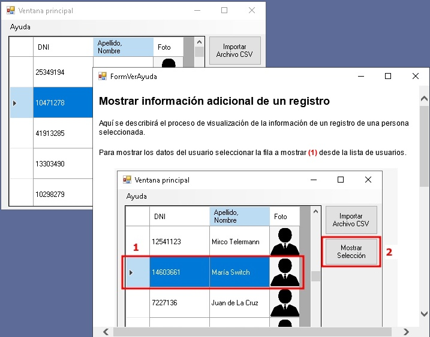
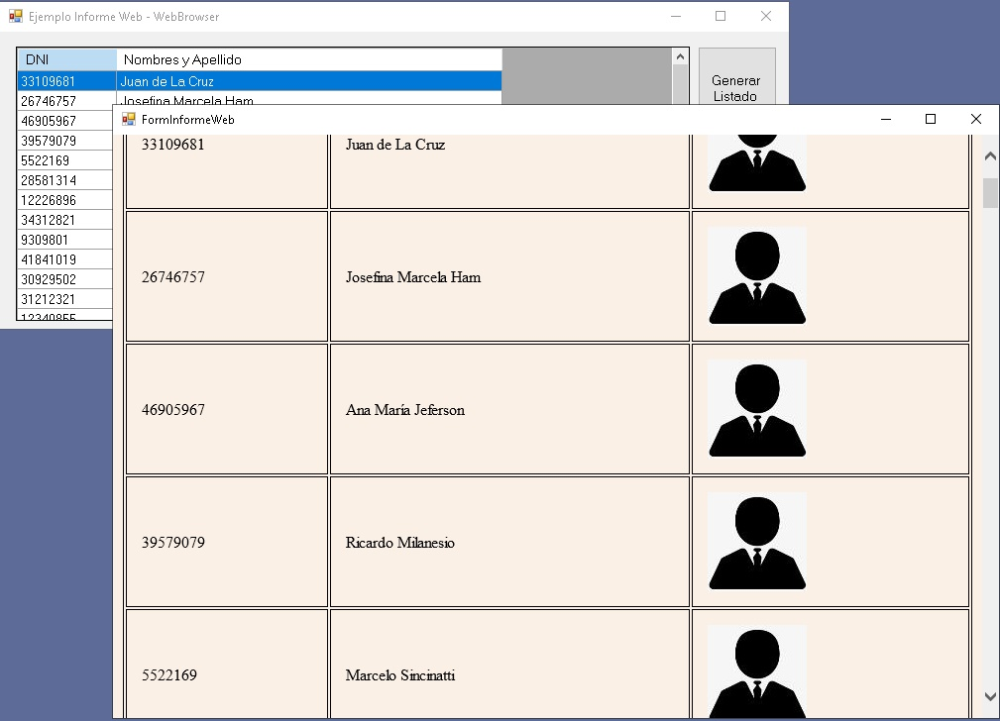

# Ejemplo de uso de controles para la visualización de páginas web

<details>
<summary># Ejemplo de ayuda web </summary>summary>

<p>El ejemplo de prueba es el siguiente:</p><br/>
<div align="center">
        
</div>

<p>El documento de ayuda web se muestra así:</p><br/>
<div align="center">
        
</div>

```csharp
        //ventana modal
        private void FormVerAyuda_Load(object sender, EventArgs e)
        {
            // caso de no incluir los documentos de ayuda en la compilación!
            // string path = Path.Combine(Application.StartupPath,"..","..","ayuda", "index.html");
            //
            // si se ha incluido los documentos de ayuda en la compilación
            string path = Path.Combine(Application.StartupPath,"ayuda", "index.html");
            //
            webBrowser1.Navigate(path);
        }
```
</details>

<details>
<summary># Ejemplos WebBrowser</summary>summary> 

<div style="text-align:center"><br/>
<div align="center">
        
</div>

<p>Para el caso de usar el control WebBrowser:</p>
  
```csharp
        private void btnVerHTML_Click(object sender, EventArgs e)
        {
            string pathRootWeb = Application.StartupPath + @"\..\..\web";

            GenHTML gen = new GenHTML();
            string pathListado = gen.GenerarListadoHTML(pathRootWeb, listado);

            FormInformeWeb fInformeWeb = new FormInformeWeb();
            fInformeWeb.webBrowser1.Navigate(pathListado);
            fInformeWeb.ShowDialog();
        }
```
</details>
        
<details>
<summary># Ejemplos WebView2 </summary>summary> 
<p>Para el caso de usar el control WebView2:</p>

```csharp
        private void btnVerHTML_Click(object sender, EventArgs e)
        {
            string pathRootWeb = Application.StartupPath + @"\..\..\web";

            GenHTML gen = new GenHTML();
            string pathListado = gen.GenerarListadoHTML(pathRootWeb, listado);

            FormInformeWeb fInformeWeb = new FormInformeWeb();
            fInformeWeb.webView21.Source = new Uri(pathListado);
            fInformeWeb.ShowDialog();
        }
```
</details>
